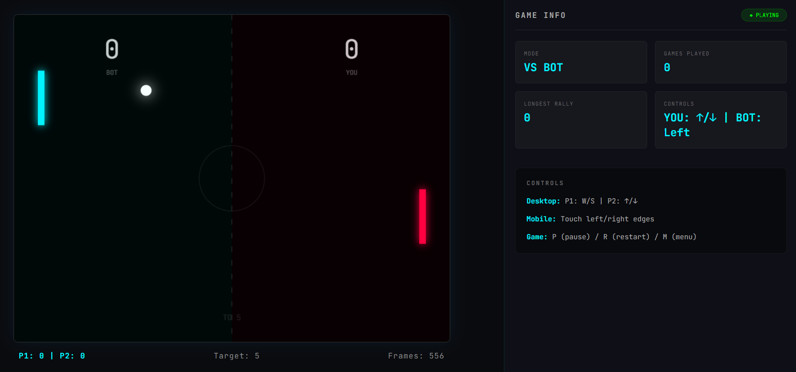

# PONG


Two paddles, one ball, a bot with commitment issues, and a terminal-style dashboard that watches the whole thing like it's monitoring a server rack. It's Pong. You already know the rules. This doc is about the plumbing.


**Play it here:** [https://furged-pong.vercel.app/](https://furged-pong.vercel.app/)


## Screenshot



## Gameplay, briefly

- **VS Bot** or **Multiplayer**, picked from the menu.
- Win target from 3 to 21, or **Infinite** if you have a grudge to settle.
- Every paddle hit nudges the ball's speed up (capped, so it doesn't become a bullet).
- Bounce angles are randomized within a range, not a clean mirror reflection, so rallies don't feel scripted even when you're hitting the same spot every time.

## The game loop

One `requestAnimationFrame` loop, doing the same two things forever:

```js
function gameLoop() {
    update();  // physics + input
    draw();    // render the frame
    requestAnimationFrame(gameLoop);
}
```

No fixed timestep, no substeps. At 60fps, for a game where the entire physics model is "does a circle overlap a rectangle," adding that complexity would've been solving a problem I didn't have.

## Ball physics

Just a velocity vector (`ballDX`, `ballDY`) added to position every frame.

- **Wall hit** → flip Y.
- **Paddle hit** → flip X, then run through a speed-up step that converts the vector to polar form (angle + magnitude), bumps the magnitude, converts back. Preserves direction, only touches speed, scaling both components directly would've quietly warped the angle over time.
- **Round reset** → new angle with a random offset, clamped so it never leaves at a flat, rally-killing angle.

## Collision detection

Axis-aligned bounding boxes. That's it. The ball is technically a circle, the check treats it like a box, at this size and speed nobody notices, and pretending otherwise would've been effort spent on a problem the pixels don't care about.

## Controls

**Desktop:** keyboard state flags (`wPressed`, `upPressed`, etc.) set on `keydown`/`keyup`, read every frame in `update()`. Smoother than reacting to the raw event, no input lag from event throttling.

**Mobile:** touch-driven, and the part that actually took effort. The lazy way to read touch input is `e.touches[0]`, the *first finger touching the screen, anywhere*. Works fine for one player. Falls apart the second a real opponent shows up, because both paddles start grabbing the same touch.

Fix: track each side's touch by its `identifier` from `changedTouches`.

```js
if (leftTouchId === null) {
    leftTouchId = touch.identifier;
}
```

Left paddle locks onto its finger, right paddle locks onto its own, two-player, two-finger, same phone, no cross-talk.

## Bot AI

Two layers of "not a robot":

1. **Baseline sloppiness** - chases the ball's Y with a randomized offset each frame instead of pixel-perfect tracking.
2. **Occasional blackout** - a small, rare per-frame chance of a short "mistake window" where it aims somewhere completely wrong for a fraction of a second.

Tuned to trigger a handful of times per game, max. Enough that it feels like the bot had a moment, not enough that it feels like the game is throwing you a bone.

## Mobile layout notes

- Canvas is sized by **height** on mobile instead of width, a width-constrained 4:3 canvas on a tall phone leaves dead space above and below it like a letterboxed movie nobody asked for.
- `touch-action` is scoped per element, not slapped on `<body>`. Turns out its *effective* value is the intersection of an element and every ancestor's value, set `none` globally and you've quietly killed scrolling on the entire page, dashboard included, and spend an hour wondering why.
- Sidebar control hints swap between keyboard and touch text depending on device, so mobile users aren't told to press ↑/↓ on a screen with no keys on it.

## Where it started

Prototype was Python, Pygame for rendering, NumPy for the vector math. The mechanics (speed scaling, angled bounces, bot tracking) carried straight over into the JS/Canvas rebuild. What changed was the delivery: no installs, runs from a URL, works on a phone.

## Files

```
index.html   canvas, menu, settings, dashboard markup
style.css    styling + all the mobile/responsive rules
script.js    game loop, physics, AI, input handling
```

No build step. No dependencies. Open `index.html`, done.